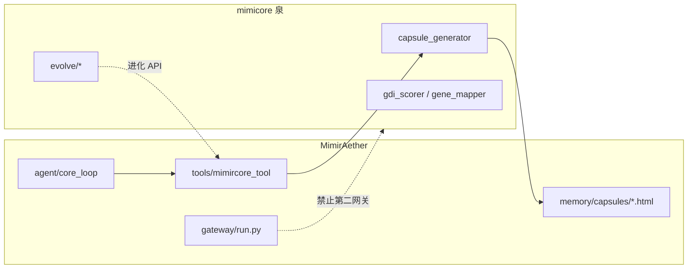

# MimirAether — mimicore「泉」范围清单

| 字段 | 值 |
|------|-----|
| **状态** | 理清期范围文档（**仅文档**；不含实现） |
| **依据** | [`MIMIR_CLARIFY_BASELINE.md`](./MIMIR_CLARIFY_BASELINE.md) §3、[`MIMIR_HTML_MEMORY_CONTRACT.md`](./MIMIR_HTML_MEMORY_CONTRACT.md) §4–§5、[`MIMIR_OPENCLAW_BOUNDARY.md`](./MIMIR_OPENCLAW_BOUNDARY.md)、[`DEVELOPMENT_NORTH_STAR.md`](./DEVELOPMENT_NORTH_STAR.md) §1–2 |
| **负责人裁定** | mimicore = **泉**（产胶囊 + 谱系/进化）；**不是**第二套完整智能体；MA 独占 gateway / 主 session / 飞书；记忆 HTML 真源在 `$MIMIR_AETHER_HOME/memory/capsules/` |

---

## 1. 范围与非目标

### 1.1 范围

- 定义 git 子模块 [`mimicore/`](../mimicore/) 在 MimirAether 中的**角色**（泉 vs 主代理 MA）。
- 对子模块**顶层能力块**做四类分类（保留在泉 / 迁出到 MA / 归档 / 待定）。
- 将 T01 **运行时触点**逐条映射到上表分类。
- 说明泉与 [`MIMIR_HTML_MEMORY_CONTRACT.md`](./MIMIR_HTML_MEMORY_CONTRACT.md) 中 `memory/` 路径的关系。
- 给出**理清期 / T06 后 / 远期**分阶段建议（无日期承诺）。
- 定义泉「瘦身」完成的**文档级**验收条件。

### 1.2 非目标

- **不实现** T06：不改 [`tools/mimircore_tool.py`](../tools/mimircore_tool.py) 扩展名、扫描路径或 HTML 发布逻辑。
- **不修改** `mimicore/` 子模块源码；不删除归档目录。
- **不**以 `mimicore/gateway`、`mimicore/cli`、`python mimicore/run.py` 作为 MA **生产**启动入口。
- **不部署** OpenClaw / weavevault（见 [`MIMIR_OPENCLAW_BOUNDARY.md`](./MIMIR_OPENCLAW_BOUNDARY.md)）。
- **不宣称** Hermes Parity 或 Evolution 闭环已达成（见北星 §2）；本文不替代 Ralph 契约或 MAINLINE 里程碑。

### 1.3 盘点方法（T04）

- 只读：`ls mimicore/`、[`mimicore/docs/README.md`](../mimicore/docs/README.md)（「记忆殿堂 v2.0」架构）、仓库内对 `mimicore` 的 import grep（见 T01 §3）。
- **不**深挖子模块实现细节。

---

## 2. 角色定义（泉 vs MA）

| 角色 | 职责 | 明确不做 |
|------|------|----------|
| **MA（MimirAether 主代理）** | [`agent/`](../agent/) 主循环、[`gateway/`](../gateway/) 通道与飞书适配、工具注册（[`tools/registry`](../tools/registry.py)）、会话与 `data/`、Ralph tier0 门禁 | 不把 mimicore 当作第二 gateway；不把 `{repo}/mimicore/public/` 或 `~/.openclaw` 当作记忆真源 |
| **泉（mimicore 子模块）** | **胶囊生成**（`capsule_generator` + GDI/基因谱系）、**进化环**（`evolve/`），以 **Python 库** 形式供 MA 调用 | 独立网关、CLI 产品面、mini_agent 主会话、飞书/主 session 抢占 |

**一句话**：**MA 编排与对外；泉 产知识胶囊与进化相关算法。**

---

## 3. 能力块分类表

盘点来源：子模块顶层目录与根级模块（2026-05-16）；[`mimicore/docs/README.md`](../mimicore/docs/README.md) 中的「记忆殿堂 v2.0」全栈架构**不作为** MA 部署范围，仅作历史对照。

| 能力块 | 简述 | 分类 | 备注 |
|--------|------|------|------|
| `capsule_generator.py`、`gdi_scorer.py`、`gene_mapper.py`、`evomap_validator.py` | 胶囊生成、GDI 评分、基因映射、校验 | **保留在泉** | MA 经 `mimircore_tool` 或维护脚本 `import` |
| `evolve/`（`three_ring_architecture`、`self_evolution`、`self_drive_engine`、`feedback/` 等） | 三环闭环、自驱进化、反馈编排 | **保留在泉** | 技能 `mimiraether-self-evolution`、`activate_self_evolution.py` 调用 |
| `public/` | 历史 `*.md` 胶囊库 | **归档/不纳入 MA** | **只读归档**；新发布 → `$MIMIR_AETHER_HOME/memory/capsules/*.html`（T02 §5.3） |
| `config/`（`model_defaults`、`loader`、`llm_config.yaml`） | 默认模型与配置加载 | **迁出到 MA** | 现被 `cli.py`、`api_service.py`、`acp_adapter` 引用；应收口到 MA 统一配置 |
| `gateway/`、`gateway/config.yaml` | 记忆殿堂独立 Gateway（IMemoryVault、缓存、审计） | **归档/不纳入 MA** | 第二套网关；MA 仅用 [`gateway/run.py`](../gateway/run.py) |
| `cli/`（`router`、`commands`、`tui`） | 记忆殿堂 CLI / TUI | **归档/不纳入 MA** | 非 MA 产品 CLI（MA 用仓库根 `cli.py`） |
| `mini_agent/` | 子模块内嵌 agent 钩子与计划文档 | **归档/不纳入 MA** | 第二套 agent 栈；仅 legacy 测试引用 |
| `agent/`（`lifecycle_manager`、`task_dispatcher`、DAME 等） | 记忆殿堂「代理」模块 | **归档/不纳入 MA** | 与 MA `agent/` 同名不同物 |
| `run.py` | 记忆殿堂独立运行验收（gateway/WAL/CLI/插件） | **归档/不纳入 MA** | 开发/子模块自测；**非** MA 运维入口 |
| `base_wal/`、`wal/` | WAL 三段式提交 | **归档/不纳入 MA** | 记忆殿堂存储协议；非 MA `data/` 契约 |
| `sensory/`、`extractor/`、`normalizer/`、`classifier/` | 语义搜索、萃取、去重、分类管线 | **归档/不纳入 MA** | 概念可借鉴到 `memory/wiki` 索引设计；**不**部署为第二记忆服务 |
| `fence/`、`permission/`、`health/`、`audit/` | 围栏、权限、观自在监控、审计 | **归档/不纳入 MA** | 记忆殿堂安全栈 |
| `pipeline/`、`library/`、`integrate/`、`repair/`、`optimize/` | 集成计划中的 RAG/压缩/纠错等 | **归档/不纳入 MA** | 见 [`INTEGRATION_PLAN.md`](../mimicore/INTEGRATION_PLAN.md)；非 MA 运行时依赖 |
| `memory_layer/`（`rl_access`） | 强化学习访问层 | **待定** | 见 §7 |
| `plugin/`、`interfaces/`（含 `adapters/`） | 插件与适配器 | **归档/不纳入 MA** | MA 生产路径无引用 |
| `introspection/`、`deduplication/`、`task/` | 内省、去重任务、任务管理 | **归档/不纳入 MA** | 记忆殿堂内部模块 |
| `docs/`、`tests/`、`test_cli_vault/`、`.omx/` | 文档、测试、内部状态 | **（不列入产品能力表）** | 子模块开发与 CI；footnote：不计入四类产品行计数 |

**§3 行数统计（产品能力行，不含脚注行）**

| 分类 | 行数 |
|------|------|
| **保留在泉** | **2** |
| **迁出到 MA** | **1** |
| **归档/不纳入 MA** | **13** |
| **待定** | **1** |

---

## 4. 运行时触点 → 分类映射

对齐 [`MIMIR_CLARIFY_BASELINE.md`](./MIMIR_CLARIFY_BASELINE.md) §3。`agent/`、`gateway/` **不**直接 `import mimicore`；触点均在 `tools/`、根 CLI、脚本与技能。

### 4.1 胶囊链

| 触点 | 分类 | 目标态（文档级） |
|------|------|------------------|
| [`tools/mimircore_tool.py`](../tools/mimircore_tool.py) | **保留在泉**（MA **薄封装**） | 继续 `import mimicore.capsule_generator`；T06 改发布/扫描为 `memory/capsules/*.html` |
| [`agent/core_loop.py`](../agent/core_loop.py) 注册 mimircore 工具 | **MA 侧** | 仅注册工具，不直接 import 泉 |
| [`agent/tool_guard.py`](../agent/tool_guard.py) | **MA 侧** | `produce_capsule`、`list_capsules` 等风险标注 |
| `run_capsule_*.py`、`run_subagent_capsule.py` | **MA 维护脚本** → 调用泉 | 非生产网关路径 |
| [`scripts/step3_append_generate_and_evaluate.py`](../scripts/step3_append_generate_and_evaluate.py) | **MA 维护脚本** → 调用泉 | 批处理生成 |
| [`scripts/diag_capsule.py`](../scripts/diag_capsule.py)、[`scripts/fix_capsule.py`](../scripts/fix_capsule.py)、[`scripts/aggregator_bridge.py`](../scripts/aggregator_bridge.py) | **MA 维护脚本** → 调用泉 | 诊断/修复；读写子模块树需谨慎，遵守 §5 |

### 4.2 配置 / CLI / 进化 / 诊断

| 触点 | 分类 | 目标态（文档级） |
|------|------|------------------|
| [`cli.py`](../cli.py)、[`api_service.py`](../api_service.py) → `mimicore.config.model_defaults` | **迁出到 MA** | 默认模型解析迁入 `agent/` 或 `mimir_constants`；子模块 `config/` 降级为可选 |
| [`scripts/smoke_mimir_home.sh`](../scripts/smoke_mimir_home.sh) | **迁出到 MA** | smoke 使用 MA 侧 `get_model()` |
| [`acp_adapter/session.py`](../acp_adapter/session.py)、[`acp_adapter/server.py`](../acp_adapter/server.py) | **迁出到 MA** | 配置/版本不依赖泉 `gateway` 配置树 |
| [`skills/mimiraether/mimiraether-self-evolution/`](../skills/mimiraether/mimiraether-self-evolution/__init__.py)、[`activate_self_evolution.py`](../activate_self_evolution.py) | **保留在泉** | `mimicore.evolve.*` · **ADR-008 path C**（非 Gateway 生产真源）；生产 SKILL 写见 [`adr/008-evolution-canonical-path.md`](./adr/008-evolution-canonical-path.md) |
| [`tools/delegate_tool.py`](../tools/delegate_tool.py) 硬编码 `../mimicore/config/config.yaml` | **迁出到 MA** | 应读 `$MIMIR_AETHER_HOME/config.yaml`；**禁止**以子模块 gateway 配置为真源 |
| `test_fix_2_dangerous_cmd.py`、`test_fix_3_fence.py` | **归档测试（legacy）** | 引用 `mini_agent` / `gateway`；理清期不扩新测 |
| [`docs/MIMIR_RUNTIME_CONTRACT.md`](./MIMIR_RUNTIME_CONTRACT.md) smoke 示例 `mimicore.config.model_defaults` | **迁出到 MA** | 文档示例随 MA 配置迁移更新（非 T04 范围） |

### 4.3 T01 已知差距（文档登记，T06 修复）

| 现象 | 说明 |
|------|------|
| `MIMIR_CORE_PATH` 默认 `~/.mimiraether/mimicore` **不存在** | 本机 import 仍落到 `{repo}/mimicore`（`sys.path`） |
| ~~`list_capsules` 扫 `MIMIR_CORE_PATH/public` → **total: 0**~~ | **Phase 1 已闭合**（2026-05-19）：`mimircore_tool` 扫描 `$MIMIR_AETHER_HOME/memory/capsules/*.html`，本机 **total=230**；见 [`phase1/P1-1-audit-summary.md`](./phase1/P1-1-audit-summary.md) |
| ~~`mimircore_tool` 发布仍为 **`*.md`** 到 `public/`~~ | **已改为 HTML** 写入 `memory/capsules/`（`produce_capsule` / 迁移脚本） |

**归档声明（Phase 1，与 HTML 契约 §5.3 一致）**

- **`{repo}/mimicore/public/*.md`**：**只读归档**；禁止作为新胶囊 publish 源。
- **`$MIMIR_AETHER_HOME/memory/capsules/*.html`**：**canonical 真源**；`list_capsules` / `get_capsule_by_id` 仅扫描此目录。
- 131 枚 md 已全部有对应 html（P1-1）；额外 96 枚 html 为会话 `produce_capsule` 等产生，非迁移遗漏。

---

## 5. 与 HTML 记忆契约的路径关系

依据 [`MIMIR_HTML_MEMORY_CONTRACT.md`](./MIMIR_HTML_MEMORY_CONTRACT.md) §4–§5。

| 项 | 契约 |
|----|------|
| **胶囊 canonical** | `$MIMIR_AETHER_HOME/memory/capsules/*.html` |
| **泉代码默认位置** | `$MIMIR_AETHER_HOME/mimicore/`（可与 git 子模块 **同版本 pin**） |
| **开发检出 / 归档** | `{repo}/mimicore/` = 子模块源码 + **`public/*.md` 只读归档** |
| **职责切分** | **泉**：生成胶囊正文、GDI/基因元数据；**MA `mimircore_tool`**：调用泉 + **写入** canonical 路径（T06 实现 HTML 与 `list_capsules` 扫描） |
| **禁止** | 新胶囊写入 `{repo}/mimicore/public/`；将泉 `gateway` 的 IMemoryVault 当作 MA 记忆真源；将 `~/.openclaw` 树当作 MA 数据根（T03） |

**过渡策略（与 T02 一致）**：新发布只认数据根 `memory/`；历史 `public/*.md` 可一次性导入转 HTML，属 T06 或单独 chore，**非** T04 实现。

---

## 6. 分阶段建议

无日期承诺；每项为可独立验收的方向。

### 6.1 理清期（当前）

- 发布本文档；与 T02 HTML 契约、T03 OpenClaw 边界交叉引用。
- [`OPERATIONS_GATEWAY.md`](./OPERATIONS_GATEWAY.md) / [`AGENTS.md`](../AGENTS.md)：**禁止**将 `mimicore/gateway`、`mimicore/cli`、`python mimicore/run.py` 列为 MA 生产启动步骤。
- **Phase 1（2026-05-19）**：存量 md→html 迁移审计完成；`list_capsules` 对本机数据根 **total≥1**；子模块 `public/` **只读归档**（见 §4.3）。
- 子模块 `public/` 视为**只读归档**；默认脚本不新增对该目录的写入。
- §4 登记 `delegate_tool`、`cli.py` 对子模块 `config/` 的依赖，列为**迁出**项。

### 6.2 T06 后

- [`tools/mimircore_tool.py`](../tools/mimircore_tool.py) 扫描/写入 `memory/capsules/*.html`；`list_capsules` 在导入或新发布后 **total ≥ 1**（HTML 契约 §5.3）。
- 文档化 `$MIMIR_AETHER_HOME/mimicore` 与 `MIMIR_CORE_ROOT`、git 子模块 pin 关系。
- 可选：历史 `public/*.md` → `memory/capsules/*.html` 一次性导入。
- `delegate_tool` 改读 `$MIMIR_AETHER_HOME/config.yaml`。
- `./run_ralph_tier0.sh` 保持绿；若改胶囊链，按 [`M6_EVOLUTION.md`](./M6_EVOLUTION.md) 记一行。

### 6.3 远期

- 子模块**冻结或删除** `gateway/`、`cli/`、`mini_agent/`、`agent/`（DAME）；产品能力收敛为 **capsule_generator + evolve + 薄 utils**。
- `model_defaults` 完全位于 MA；泉 `config/` 仅保留胶囊/进化专用项（若有）。
- 进化环与 MAINLINE 阶段 C/∞ **证据链**对齐（指标 + 回归，北星 §2.2）。
- 拍板 §7 待定项（`memory_layer`、记忆殿堂管线复用策略）。
- 可选 CI：grep 禁止 `agent/`/`gateway/` 新增对归档栈的生产 import。

---

## 7. 待定项（≤3，需负责人拍板）

1. **`memory_layer/`（`rl_access`）** — 纳入泉进化反馈闭环，还是整目录**归档**。
2. **数据根 `$MIMIR_AETHER_HOME/mimicore/` vs 仅 repo 子模块** — 部署是否**必须**复制/同步子模块到数据根（与 T02 §5.3、`MIMIR_CORE_ROOT` 联动）。
3. **记忆殿堂管线**（`sensory` / `extractor` / `normalizer` / `classifier`）— 未来 MA 对 `memory/wiki` 建索引时**复用子模块算法**（库调用），还是**仅概念借鉴、运行时代码永不迁入 MA**。

**说明**：待定项**不阻塞** T06（胶囊 HTML + `mimircore_tool`）开工。

---

## 8. 验收（泉「瘦身」— 文档级）

负责人或 Agent 阅读本文 + [`path-contract.md`](./path-contract.md) 后，应能逐项核对：

| # | 可检查条件 |
|---|------------|
| 1 | 存在 **`docs/MIMIR_MIMICORE_SPRING_SCOPE.md`**，§3 覆盖子模块**全部顶层产品能力块**（含归档栈与泉核心）。 |
| 2 | **无** MA 运维文档将 `mimicore/gateway`、`mimicore/cli`、`python mimicore/run.py` 列为**生产**启动步骤。 |
| 3 | T01 §3 触点在 §4 **逐条**有分类（胶囊链 + 配置/进化/脚本）。 |
| 4 | 与 HTML 契约一致：**新胶囊**只认 `$MIMIR_AETHER_HOME/memory/capsules/*.html`；`{repo}/mimicore/public/` **只读归档**。 |
| 5 | **归档**类能力块：理清期 **无新增** MA `agent/` / `gateway/` 对 `mimicore.gateway` / `mini_agent` 等的生产依赖（legacy 测试除外）。 |
| 6 | **待定** ≤ 3 条，且已标明不阻塞 T06。 |

**新人自测问答**

| 问题 | 期望要点 |
|------|----------|
| mimicore 是什么？ | **泉**：产胶囊 + 进化算法库；**不是**第二个 gateway/agent |
| MA 如何用它？ | 经 **`tools/mimircore_tool`**（及少量脚本/技能）`import` 泉核心模块 |
| 胶囊发布写哪？ | **`$MIMIR_AETHER_HOME/memory/capsules/*.html`**（理清期目标；T06 实现） |
| 子模块 `public/` 还能写吗？ | **否**（新写入禁止）；历史 MD **只读归档** |
| 能否 `python mimicore/run.py` 启动 MA？ | **否**；MA 网关为 **`{git clone}/gateway/run.py`** |

---

## 附录：T05 / T06 关系

| 任务 | 关系 |
|------|------|
| **T06** | **前置**：T02 HTML 契约 + T03 边界 + **本文档（T04）**；T04 不阻塞 T06，但 T06 PR 应引用 §3–§5，避免把**归档栈**（gateway/cli/mini_agent）带回 MA 运行时。 |
| **T05** | 仓库内**无**独立 T05 定义。若战略侧指 **wiki/obsidian 与 `config.yaml` 对齐**（T02 §6），建议作为 **T06 之后的小 chore** 或并入 T06 的 config 改动；**可跳过独立 T05**，避免与胶囊 HTML 同 PR 争抢。 |

---

## 相关文档

- [`MIMIR_CLARIFY_BASELINE.md`](./MIMIR_CLARIFY_BASELINE.md) — T01 触点与路径实测  
- [`MIMIR_HTML_MEMORY_CONTRACT.md`](./MIMIR_HTML_MEMORY_CONTRACT.md) — 记忆 HTML 真源与 `memory/` 布局  
- [`MIMIR_OPENCLAW_BOUNDARY.md`](./MIMIR_OPENCLAW_BOUNDARY.md) — OpenClaw / weavevault 零部署  
- [`path-contract.md`](./path-contract.md) — 仓库根 vs 数据根  
- [`DEVELOPMENT_NORTH_STAR.md`](./DEVELOPMENT_NORTH_STAR.md) — Parity / Evolution  
- [`OPERATIONS_GATEWAY.md`](./OPERATIONS_GATEWAY.md) — MA 网关运维（非 mimicore gateway）  
- [`M6_EVOLUTION.md`](./M6_EVOLUTION.md) — 进化审计  
